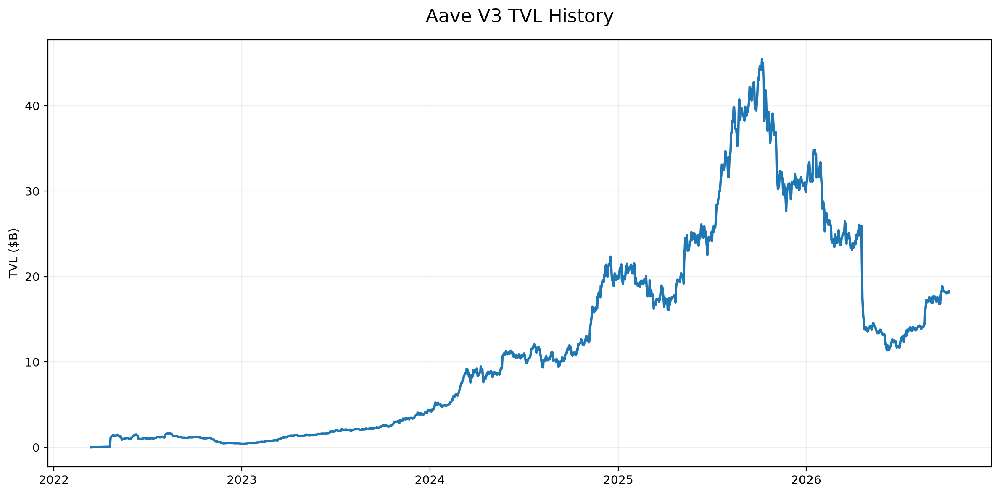
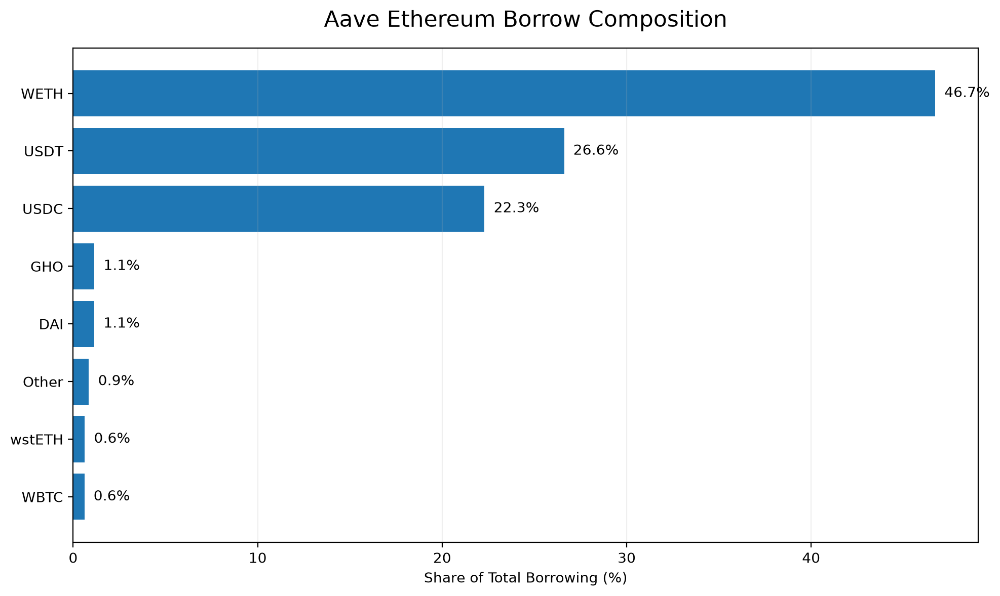
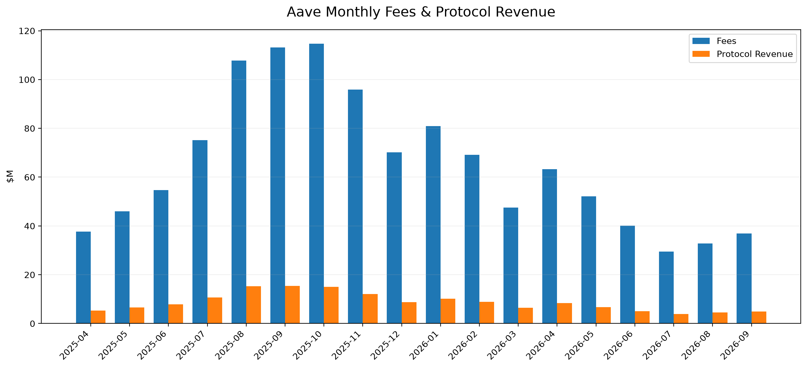
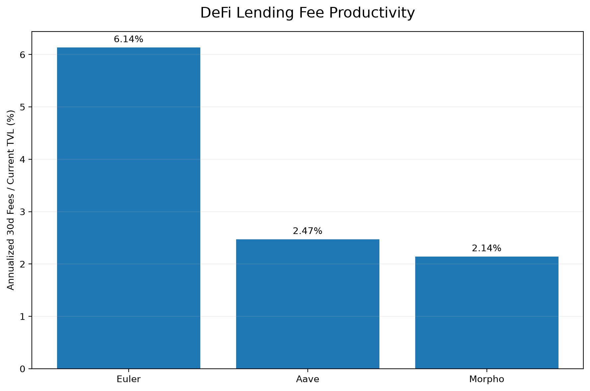
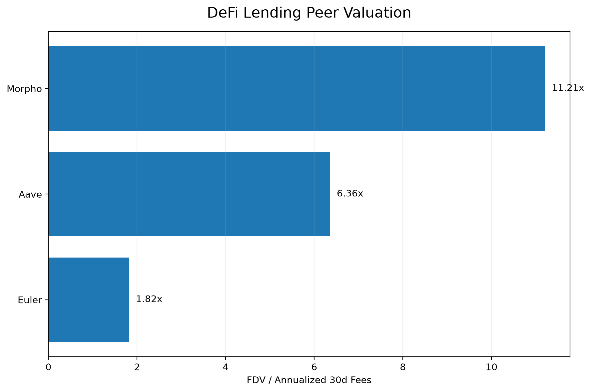
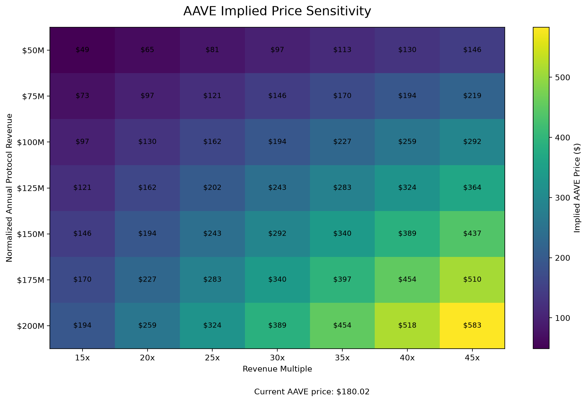

# Aave Fundamental Analysis

**Data-driven fundamental analysis of Aave covering lending economics, protocol revenue, DAO profitability, competitive positioning, token economics, and AAVE valuation.**

> **Investment View: Neutral / Moderately Bullish**

This project combines protocol-level data, reserve-level lending data, DAO financials, token market data, and peer analysis to evaluate Aave as both a DeFi protocol and an investable crypto asset.

---

## Investment Snapshot

| Metric | Value |
|---|---:|
| Aave V3 TVL | ~$18.3B |
| Ethereum V3 Borrowed | ~$10.1B |
| Ethereum Aggregate Utilization | ~40.5% |
| Top-3 Borrow Concentration | ~95.6% |
| 30d Annualized Fees | ~$452M |
| 30d Annualized Protocol Revenue | ~$59.5M |
| AAVE Market Cap | ~$2.8B |
| MCap / TTM Revenue | ~29.7x |
| MCap / Current Revenue Run-rate | ~46.7x |
| Circulating / Max Supply | ~96.5% |

*Metrics represent snapshots and trailing/run-rate calculations from the dataset used in this analysis. They should not be interpreted as forecasts.*

---

## Key Findings

- **Aave remains the largest protocol in the lending peer set analyzed**, with approximately $18B of TVL and an established protocol monetization model.

- **Ethereum borrowing is highly concentrated.** WETH, USDT, and USDC account for approximately **95.6% of total borrowing** in the analyzed Aave V3 Ethereum market.

- **TVL does not equal economically productive lending capital.** Several large reserves primarily function as collateral assets rather than active borrow-demand markets.

- **Protocol activity contracted materially from late-2025 levels**, although recent monthly data indicates an early recovery in fee generation.

- **Monetization remained relatively stable despite declining activity.** Protocol revenue represented roughly **13% of fees** across the analyzed 30d, 90d, and 365d periods.

- **AAVE is not a direct claim on protocol revenue.** Token valuation therefore depends not only on protocol growth, but also on DAO profitability, treasury allocation, governance decisions, and the durability of token value-accrual mechanisms.

- At the analyzed market capitalization, **the market already appears to price in a meaningful recovery in Aave economics**, limiting upside from a simple return to historical revenue levels.

---

## Research Question

The central question of this analysis is:

> **Can Aave convert its dominant lending-market position into sustainably growing DAO surplus and AAVE token value accrual?**

---

## 1. Protocol Overview

Aave is a decentralized liquidity protocol that allows users to supply crypto assets, earn interest, borrow against collateral, and access liquidity across multiple blockchain networks.

The core economic engine is lending activity:

**Depositors → Liquidity → Borrowers → Interest → Suppliers + Protocol**

Aave therefore has several distinct economic layers:

1. Capital deposited into the protocol.
2. Capital actively borrowed.
3. Interest paid by borrowers.
4. Fees and revenue captured by the protocol.
5. DAO-level income and expenses.
6. Potential value accrual to AAVE holders.

These layers should not be treated as interchangeable.

In particular:

> **TVL ≠ Borrow Demand ≠ Protocol Revenue ≠ DAO Net Income ≠ Tokenholder Earnings**

This distinction forms the foundation of the analysis.

---

## 2. Market Position

Aave operates at significantly greater scale than most decentralized lending competitors.

The peer set used in this project includes:

- Aave
- Morpho
- Euler

At the time of analysis:

| Protocol | TVL | 30d Fees | 1y Fees |
|---|---:|---:|---:|
| Aave | ~$18.3B | ~$37.2M | ~$726.4M |
| Morpho | ~$11.3B | ~$20.0M | ~$205.7M |
| Euler | ~$0.35B | ~$1.8M | ~$46.4M |

Morpho has reached approximately **62% of Aave's TVL**, making it a material competitor.

However, Aave generates substantially more fees relative to its scale.

Aave's trailing-year fees were approximately **3.5x Morpho's**, despite Aave having only around **1.6x the TVL**.

This suggests that Aave's current liquidity base is more productive from a fee-generation perspective.

---

## 3. TVL Dynamics



Aave V3 TVL in the dataset:

- Current TVL: approximately **$18.2B**
- Historical peak: approximately **$45.4B**
- Drawdown from peak: approximately **-60%**
- 30d change: approximately **+8%**
- 90d change: approximately **+42%**

The recent TVL recovery is significant, but TVL growth should not automatically be interpreted as equivalent growth in protocol fundamentals.

TVL can increase because of:

- asset-price appreciation;
- net deposits;
- collateral inflows;
- migration between markets;
- changes in reserve composition.

For that reason, lending activity must be analyzed separately.

---

## 4. Lending Economics

The reserve-level analysis uses the Aave V3 Ethereum market.

At the analyzed snapshot:

- Calculated supplied capital: approximately **$25.0B**
- Total borrowed: approximately **$10.1B**
- Aggregate utilization: approximately **40.5%**
- Estimated annual borrower interest at current rates: approximately **$334M**
- Snapshot-based estimated protocol interest: approximately **$44M**

The protocol-interest estimate is calculated as:

```text
Borrowed USD × Borrow APY × Reserve Factor
```

This is a **snapshot-based annualized estimate**, not realized Aave protocol revenue.

### Borrow Composition



Borrowing is extremely concentrated.

The largest borrowing markets are approximately:

| Asset | Share of Borrowing |
|---|---:|
| WETH | ~46.7% |
| USDT | ~26.6% |
| USDC | ~22.3% |
| GHO | ~1.1% |
| DAI | ~1.1% |

WETH, USDT, and USDC therefore account for approximately:

> **95.6% of total analyzed borrowing**

This is one of the most important findings of the project.

Aave supports many collateral assets, but only a small number of reserves drive the majority of credit demand.

---

## 5. Collateral Infrastructure vs Credit Markets

Several large reserves show low utilization despite having substantial supplied capital.

Examples include assets such as:

- wstETH / LST-related collateral
- weETH
- rsETH
- WBTC-related assets
- other collateral-oriented reserves

Low utilization does not necessarily imply that these markets are economically irrelevant.

Instead, many reserves primarily serve as collateral infrastructure.

This leads to an important distinction:

> **Aave as collateral infrastructure is not the same thing as Aave as a credit market.**

USDC, USDT, and WETH are highly active credit markets.

Many other assets primarily increase collateral breadth and borrowing capacity elsewhere in the system.

As a result, aggregate TVL materially overstates the amount of capital directly generating lending activity.

---

## 6. Protocol Economics



The analysis separates user-paid fees from protocol revenue.

### Current Economics

| Period | Fees | Protocol Revenue | Revenue / Fees |
|---|---:|---:|---:|
| 30d | ~$37.2M | ~$4.9M | ~13.1% |
| 90d | ~$98.5M | ~$13.3M | ~13.5% |
| 365d | ~$724.2M | ~$93.6M | ~12.9% |

The latest 30-day period implies approximately:

- **$452M annualized fees**
- **$59M annualized protocol revenue**

The relatively stable revenue-to-fee ratio is important.

Aave's decline in revenue during 2026 appears to have been driven primarily by lower fee-generating activity rather than a major deterioration in protocol monetization.

### Activity Trend

Monthly fees declined substantially from late-2025 levels.

Approximate monthly fees:

| Month | Fees |
|---|---:|
| Oct 2025 | ~$114.8M |
| Jan 2026 | ~$80.9M |
| Apr 2026 | ~$63.3M |
| Jul 2026 | ~$29.4M |
| Aug 2026 | ~$32.8M |
| Sep 2026 | ~$36.9M |

The decline from October 2025 to July 2026 was severe.

However, August and September show an early recovery.

The key analytical question is therefore whether the decline represents:

**a structural deterioration in Aave's economics**

or

**a cyclical trough followed by renewed borrowing activity.**

---

## 7. Capital Productivity



To compare lending protocols, this project uses:

```text
Annualized latest 30d fees / Current TVL
```

rather than dividing historical one-year fees by current TVL.

This improves temporal consistency between the numerator and denominator.

Approximate current annualized fee productivity:

| Protocol | Annualized Fees / TVL |
|---|---:|
| Aave | ~2.5% |
| Morpho | ~2.1% |
| Euler | ~6.1% |

Euler appears highly productive on this metric, but its much smaller scale and changing economics make direct valuation conclusions inappropriate.

Capital productivity therefore needs to be interpreted together with:

- scale;
- growth;
- risk;
- monetization;
- token economics.

---

## 8. Competitive Analysis

Aave's most important competitive comparison in this project is Morpho.

### Aave

Strengths:

- greater liquidity scale;
- established protocol revenue;
- broad collateral support;
- mature lending infrastructure;
- high activity in core WETH and stablecoin markets.

Weaknesses:

- recent contraction in activity;
- borrowing concentration;
- relatively mature growth profile.

### Morpho

Strengths:

- strong recent growth;
- significant TVL relative to Aave;
- different lending architecture;
- potential future monetization optionality.

Weaknesses:

- protocol-level revenue capture is not directly comparable with Aave;
- greater valuation dependence on future growth and monetization;
- larger remaining token supply relative to AAVE.

Morpho's latest annualized fee run-rate was above its trailing-year fee level, while Aave's current run-rate remained materially below its trailing-year level.

The market is therefore valuing two different profiles:

> **AAVE = established monetized lending franchise**

> **MORPHO = higher-growth / future-monetization thesis**

---

## 9. Peer Valuation



Approximate valuation metrics:

| Metric | AAVE | MORPHO | EUL |
|---|---:|---:|---:|
| MCap / TVL | ~0.15x | ~0.17x | ~0.10x |
| MCap / Current Annualized Fees | ~6.1x | ~7.9x | ~1.6x |
| FDV / Current Annualized Fees | ~6.4x | ~11.2x | ~1.8x |
| MCap / 1y Fees | ~3.8x | ~9.3x | ~0.7x |

AAVE trades at a lower FDV-to-current-fee multiple than MORPHO despite already having an established protocol monetization model.

This does **not** automatically imply that AAVE is undervalued.

The difference can reflect:

- Morpho's higher expected growth;
- future monetization expectations;
- different token economics;
- different protocol architecture;
- different risk profiles.

Low multiples are not automatically cheap, and high multiples are not automatically expensive.

---

## 10. DAO Economics

Protocol revenue is not the final economic layer.

Aave DAO also has operating expenses.

The DAO financial dataset used in this analysis contains approximately:

| Period | Revenue | Expenses | Net Income | Net Margin |
|---|---:|---:|---:|---:|
| 2025 | $152.4M | $109.2M | $43.2M | 28.4% |
| 2026 YTD | $82.1M | $56.3M | $25.8M | 31.4% |

The periods are not equal in length and should not be compared as equivalent annual periods.

However, the data suggests that the DAO remained profitable while maintaining a net margin of roughly 30%.

The key economic chain therefore becomes:

```text
Protocol Activity
        ↓
Fees
        ↓
Protocol Revenue
        ↓
DAO Revenue
        ↓
DAO Expenses
        ↓
DAO Net Income
        ↓
Capital Allocation
        ↓
Potential AAVE Value Accrual
```

This is more useful for token analysis than treating gross protocol revenue as if it belonged directly to AAVE holders.

---

## 11. AAVE Token Economics

At the analyzed snapshot:

- AAVE price: approximately **$180**
- Market capitalization: approximately **$2.8B**
- FDV: approximately **$2.9B**
- Circulating supply: approximately **15.4M AAVE**
- Maximum supply: **16M AAVE**
- Circulating / max supply: approximately **96.5%**

The remaining supply overhang is therefore relatively small.

This is a positive characteristic compared with tokens that have substantial future unlocks.

### Value Accrual

AAVE should not be modeled as equity.

Protocol revenue does not automatically flow to tokenholders.

Potential token value accrual depends on governance-controlled mechanisms such as:

- treasury allocation;
- protocol-funded token purchases;
- ecosystem incentives;
- governance utility;
- strategic use of DAO surplus.

Therefore:

> **Protocol Revenue ≠ Tokenholder Earnings**

Any valuation multiple based on protocol revenue must be interpreted as a proxy for protocol economic scale rather than a conventional P/E multiple.

---

## 12. Valuation

At the analyzed token price and market capitalization:

- Market Cap: approximately **$2.78B**
- FDV: approximately **$2.88B**
- TTM Fees: approximately **$724M**
- TTM Protocol Revenue: approximately **$94M**
- Current annualized fee run-rate: approximately **$452M**
- Current annualized revenue run-rate: approximately **$59M**

This produces approximately:

| Metric | Multiple |
|---|---:|
| MCap / TTM Fees | ~3.8x |
| MCap / TTM Revenue | ~29.7x |
| FDV / TTM Revenue | ~30.8x |
| MCap / Current Annualized Fees | ~6.1x |
| MCap / Current Annualized Revenue | ~46.7x |

The difference between trailing and current multiples is important.

The trailing period includes significantly stronger activity from late 2025.

Therefore, **TTM revenue currently makes AAVE appear cheaper than the latest revenue run-rate does.**

---

## 13. Scenario Analysis



A simplified scenario framework uses:

```text
Implied Market Cap =
Normalized Protocol Revenue × Revenue Multiple
```

and:

```text
Implied AAVE Price =
Implied Market Cap / Current Circulating Supply
```

### Scenarios

| Scenario | Revenue | Multiple | Implied MCap | Implied Price | Upside / Downside |
|---|---:|---:|---:|---:|---:|
| Bear | $50M | 20x | $1.0B | ~$65 | ~-64% |
| Base | $100M | 30x | $3.0B | ~$194 | ~+8% |
| Bull | $150M | 35x | $5.25B | ~$340 | ~+89% |

These scenarios are illustrative, not price targets.

The important conclusion is that a simple recovery toward approximately $100M of normalized protocol revenue does not create substantial upside at the analyzed valuation.

A stronger bull case requires Aave to generate **material growth beyond simple normalization**.

---

## 14. DAO Profitability and Buyback Capacity

DAO net income provides another way to frame potential token value accrual.

At approximately $43M of 2025 net income:

- MCap / DAO Net Income ≈ **64x**
- Net Income / MCap ≈ **1.6%**

This does not imply a 1.6% tokenholder yield.

DAO net income belongs to the DAO and can be allocated according to governance decisions.

However, it provides a useful framework for estimating potential capital-return capacity.

For example, if normalized DAO net income eventually reached:

```text
$100M
```

and governance allocated:

```text
50%
```

toward AAVE purchases, that would represent approximately:

```text
$50M of annual token demand
```

before considering price impact or other treasury decisions.

The important variable is therefore not merely protocol revenue.

It is:

> **Sustainable DAO surplus × Share allocated toward AAVE value accrual**

---

## 15. Catalysts

Potential positive catalysts include:

- recovery in stablecoin borrowing;
- stronger ETH leverage demand;
- continued growth in Aave's multi-chain liquidity network;
- GHO expansion;
- new Aave products and revenue streams;
- improved DAO operating leverage;
- sustained protocol-funded AAVE demand;
- continued dominance in institutional-grade DeFi lending infrastructure.

---

## 16. Risks

### Competitive Risk

Morpho has already reached material scale relative to Aave and is growing from a smaller base.

### Activity Risk

Aave's current fee and revenue run-rates remain materially below stronger late-2025 levels.

### Concentration Risk

Approximately 95% of analyzed Ethereum borrowing is concentrated in WETH, USDT, and USDC.

### Valuation Risk

AAVE does not appear obviously cheap when valued against the latest annualized protocol revenue.

### Token Value-Accrual Risk

AAVE holders do not have an automatic contractual claim on protocol revenue or DAO profits.

### Governance Risk

Capital allocation depends on DAO governance and may change over time.

### Smart-Contract and Oracle Risk

Aave remains exposed to the technical risks inherent in decentralized lending infrastructure.

---

## 17. Investment Thesis

### Bull Case

The bullish thesis is based on Aave maintaining its position as a core DeFi credit layer while converting scale into increasing economic output.

A bullish outcome would likely require:

- sustained borrowing recovery;
- higher normalized protocol revenue;
- continued DAO profitability;
- growth in GHO and adjacent products;
- disciplined expenses;
- durable AAVE value-accrual mechanisms.

### Bear Case

The bearish thesis is that Aave remains a dominant protocol but that dominance does not translate into sufficient tokenholder economics.

The bear case includes:

- structurally lower lending activity;
- stronger competition from Morpho and other lending architectures;
- limited DAO surplus growth;
- weak connection between protocol economics and AAVE;
- valuation multiples compressing as growth expectations fall.

### Current View

> **Neutral / Moderately Bullish**

Aave is a high-quality DeFi protocol with meaningful scale, proven monetization, and relatively low token dilution.

However, the analyzed AAVE valuation already assumes a meaningful degree of economic recovery.

The strongest bull case therefore requires more than stabilization.

It requires Aave to demonstrate that it can grow normalized economic output and translate that growth into durable AAVE value accrual.

---

## 18. Data Sources

| Dataset | Source | Usage |
|---|---|---|
| Aave V3 TVL | DefiLlama | Historical protocol TVL |
| Protocol Fees | DefiLlama | Daily fees and activity trends |
| Protocol Revenue | DefiLlama | Protocol monetization analysis |
| Ethereum Reserves | Aave API | Supply, borrowing, utilization, APYs and reserve factors |
| AAVE Market Data | CoinGecko | Price, market cap, FDV and token supply |
| Peer Protocol Data | DefiLlama | Aave, Morpho and Euler comparison |
| Peer Token Data | CoinGecko | Market capitalization and supply comparison |
| DAO Financials | Aave ecosystem financial reporting / Aave Insights | DAO revenue, expenses and net income |

Data is stored locally in `data/raw/` and transformed outputs are stored in `data/processed/`.

---

## 19. Methodology

The project follows a research pipeline:

```text
External APIs / Protocol Data
            ↓
        Raw Data
            ↓
      Python Analysis
            ↓
     Processed Metrics
            ↓
      Visualizations
            ↓
 Fundamental Research
            ↓
       Valuation
            ↓
   Investment Thesis
```

Key methodological principles:

- distinguish TVL from productive lending capital;
- distinguish fees from protocol revenue;
- distinguish protocol revenue from DAO profitability;
- distinguish DAO profitability from tokenholder earnings;
- use current annualized flows when comparing against current TVL;
- separate trailing historical performance from current run-rate;
- treat scenario valuation as sensitivity analysis rather than price prediction.

---

## 20. Repository Structure

```text
aave-fundamental-analysis/
│
├── charts/
│   ├── aave_borrow_composition.png
│   ├── aave_monthly_fees_revenue.png
│   ├── aave_tvl_history.png
│   ├── aave_valuation_sensitivity.png
│   ├── lending_fee_productivity.png
│   └── lending_peer_valuation.png
│
├── data/
│   ├── raw/
│   └── processed/
│
├── src/
│   ├── analyze_aave.py
│   ├── analyze_competitors.py
│   ├── analyze_dao_financials.py
│   ├── analyze_fees.py
│   ├── analyze_protocol_economics.py
│   ├── analyze_valuation.py
│   ├── create_charts.py
│   ├── fetch_aave.py
│   ├── fetch_competitors.py
│   ├── fetch_defillama.py
│   ├── fetch_defillama_fees.py
│   ├── fetch_defillama_revenue.py
│   ├── fetch_peer_tokens.py
│   ├── fetch_token_data.py
│   ├── metrics.py
│   ├── peer_valuation.py
│   └── scenario_valuation.py
│
├── .gitignore
├── README.md
└── requirements.txt
```

---

## 21. Running the Analysis

Clone the repository:

```bash
git clone https://github.com/Amexover/aave-fundamental-analysis.git
cd aave-fundamental-analysis
```

Create a virtual environment:

```bash
python3 -m venv .venv
source .venv/bin/activate
```

Install dependencies:

```bash
python3 -m pip install -r requirements.txt
```

Fetch the main datasets:

```bash
python3 src/fetch_defillama.py
python3 src/fetch_aave.py
python3 src/fetch_defillama_fees.py
python3 src/fetch_defillama_revenue.py
python3 src/fetch_token_data.py
python3 src/fetch_competitors.py
python3 src/fetch_peer_tokens.py
```

Run the analysis:

```bash
python3 src/analyze_aave.py
python3 src/analyze_fees.py
python3 src/analyze_protocol_economics.py
python3 src/analyze_competitors.py
python3 src/analyze_valuation.py
python3 src/peer_valuation.py
python3 src/analyze_dao_financials.py
python3 src/scenario_valuation.py
```
### Run the Full Pipeline

Run the complete research pipeline with a single command:

```bash
python3 run_analysis.py
```

This command automatically:

1. Fetches the latest protocol and market data.
2. Runs the fundamental analysis.
3. Calculates peer and valuation metrics.
4. Generates all research charts.

Individual scripts in `src/` can also be executed separately for specific parts of the analysis.
## 22. Limitations

This project has several important limitations:

- API data represents different combinations of snapshots and historical series.
- TVL can change because of token-price movements rather than net capital flows.
- Current annualized metrics extrapolate short periods and are not forecasts.
- Reserve-level protocol-interest estimates use current balances and rates.
- Peer revenue definitions may differ across protocols.
- DAO financial reporting and protocol-level revenue are not identical accounting concepts.
- Token value accrual depends on governance and should not be treated as contractual cash flow.
- Scenario valuation is illustrative and highly sensitive to revenue and multiple assumptions.

---

## Tech Stack

- **Python**
- **pandas**
- **requests**
- **matplotlib**
- **GraphQL**
- **Aave API**
- **DefiLlama API**
- **CoinGecko API**

---

## Disclaimer

This project is for educational and research purposes only.

It is not investment advice.